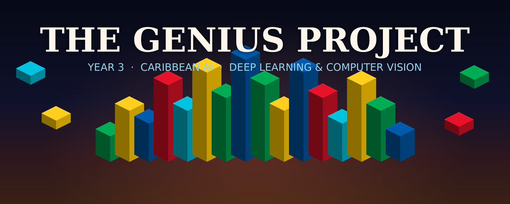

<p align="center">
  
</p>

# The Genius Project, Year 3

**An AI course for teenagers, taught through the World Cup.**

*Author: The Genius Project Year 3*

Welcome. This repository teaches you to build real artificial intelligence models with no
prior experience. You start by learning Python from scratch, then you train five different
models to predict the winners of upcoming World Cup matches. From there you turn the same
tools on money: budgeting, simulation, and forecasting the markets. By the end you
will have used the same tools that professional AI engineers use every day.

**Football note:** this course uses the word *football* for the sport played with a round ball
and a net (called *soccer* in some countries). Every stat is explained in plain words, so you
do not need to follow football to take part.

---

## What you will do

- **Learn Python from zero.** Nine short notebooks take you from your first line of code to reading real data.
- **Train five prediction models.** A logic model, a decision tree, a neural network, a cluster model, and a bonus deep learning model.
- **Predict real fixtures.** Every model outputs the win chance for each team, the expected scoreline, and the stats that decided it.
- **Submit your call.** Enter your prediction on the Week 2 quiz and prediction page.
- **Take on finance.** In Week 3 you use statistics, Monte Carlo simulation, time-series forecasting, and machine learning on budgets and market prices.

## Where to start

### 1. Introduction to Python

New to coding? Open the **`Introduction to Python`** folder and work through the notebooks in order.
They go from basic to intermediate:

| # | Notebook | You learn |
| --- | --- | --- |
| 1 | `01-hello-python.ipynb` | Printing and comments |
| 2 | `02-numbers-and-variables.ipynb` | Variables and maths |
| 3 | `03-text-and-strings.ipynb` | Working with words |
| 4 | `04-lists.ipynb` | Holding many values |
| 5 | `05-loops.ipynb` | Repeating actions |
| 6 | `06-making-decisions.ipynb` | if, elif, and else |
| 7 | `07-functions.ipynb` | Reusable machines |
| 8 | `08-dictionaries-and-data.ipynb` | Labelled data |
| 9 | `09-real-data-with-pandas.ipynb` | Reading the football dataset |

### 2. Week 2: Predicting World Cup Matches

Once you are comfortable with Python, open the **`Week 2`** folder and build the models in order.
Full details are in `Week 2/README.md`.

| Model | Notebook | The big idea |
| --- | --- | --- |
| Logic model | `01-logic-model.ipynb` | Weigh every stat and add up the evidence |
| Decision tree | `02-decision-tree-model.ipynb` | A flowchart of yes and no questions |
| Neural network | `03-neural-network-model.ipynb` | A small brain that mixes all the stats at once |
| Cluster model | `04-cluster-model.ipynb` | Group teams by style, predict from history |
| Deep learning (bonus) | `05-bonus-deep-learning.ipynb` | The tools used in real AI labs |

### 3. Week 3: Machine Learning for Finance and Budgeting

Ready for a new challenge? Open the **`Week 3`** folder. No football this time. You
point the same tools at money, from reading a budget to forecasting the markets. Full
details are in `Week 3/README.md`.

| Notebook | The big idea |
| --- | --- |
| `01-money-and-statistics.ipynb` | Read a budget with average, spread, and seasonality |
| `02-monte-carlo-simulation.ipynb` | Simulate thousands of futures to find your savings odds |
| `03-time-series-and-stationarity.ipynb` | Why prices drift and returns do not |
| `04-time-series-forecasting.ipynb` | Forecast tomorrow, and grade the guess honestly |
| `05-machine-learning-for-finance.ipynb` | Predict spending and the stock's next move |
| `06-bonus-neural-network.ipynb` | A neural network takes on a near-random market |

## Submit your prediction

After you run a model, enter your prediction on the Week 2 page:

**https://beagenius.org/tgp-2026teens-week2/06-quiz-and-predict.html**

## How to run the notebooks

You need Python with a few common libraries. Install them once:

```bash
pip install pandas numpy scikit-learn matplotlib jupyter
# the bonus deep learning notebook also needs:
pip install tensorflow
```

Then launch Jupyter and open any notebook:

```bash
jupyter notebook
```

Run a notebook one box at a time with **Shift + Enter**. Read the note above each box, run it,
then try changing something. You cannot break anything by running code.

## About the data

The football data in `Week 2/data` is a realistic teaching dataset. The numbers are believable
and the patterns are real, so the models learn genuine football logic, but they are not official
statistics. Every column is explained in `Week 2/data/variable_dictionary.md`.

The Week 3 money data in `Week 3/data` (a personal budget and a made-up company's share price)
works the same way: believable numbers with real patterns, generated from a fixed random seed,
but not records of any real person or company. Every column is explained in
`Week 3/data/variable_dictionary.md`. Week 3 needs only the core libraries above, no
TensorFlow required.

## Teens: Pitch & Win competition

Ten high-school teams pitched an AI startup, and a council of ten judges scored every
pitch against one brief: make as much money as possible, and be profitable. The results
subpage announces the winner, then lays out the full leaderboard, the ten-judge
scorecard, and specific feedback for every team.

Open **`pitch-and-win/index.html`** in a browser to see it (winner reveal, leaderboard,
scorecard, and judge feedback). It is a single self-contained page, so no setup is needed.

## Live activities

Two teen activities are deployed and ready to use:

| Activity | Live link | What it does |
| --- | --- | --- |
| **Spycraft** | https://tgp-spycraft-teens.netlify.app | A one-tap party game. Each player enters their first name and email, then sees a bright red screen (spy) or green screen (clean). Five spies are chosen by tap order and saved to Netlify. Organizer view at `/admin.html`. |
| **Hurricane Melissa App Challenge** | https://tgp-hurricane-melissa.netlify.app | The full event brief plus an interactive AI App Canvas that each team fills in and saves to Netlify. |

The code for these lives in the `spycraft/` and `hurricane-melissa/` folders.

## License

Released under the MIT License. See `LICENSE`.
